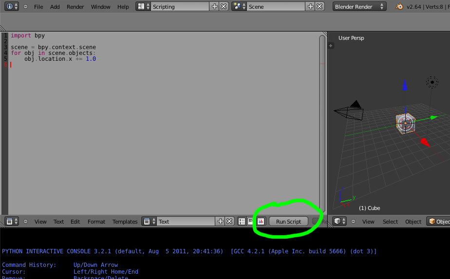
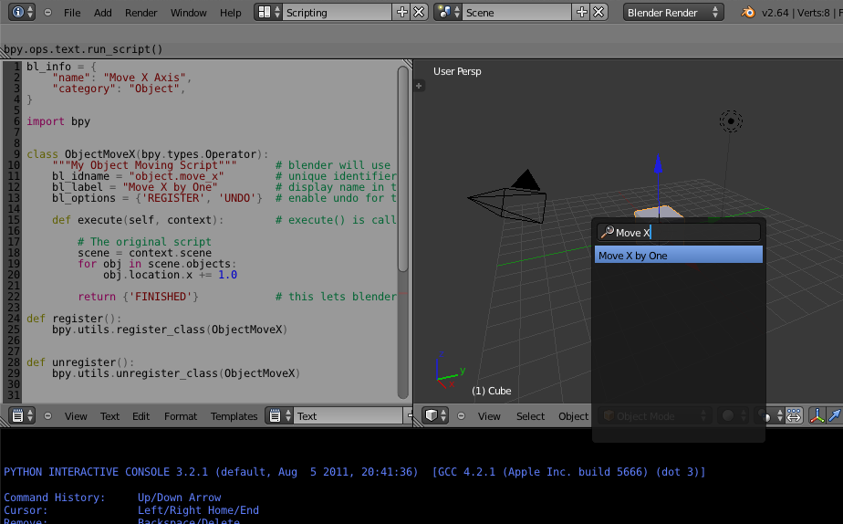

##############
Addon Tutorial
##############

************
Introduction
************

Intended Audience
=================

This tutorial is designed to help technical artists or developers learn to extend blender. An understanding of the basics of Python is expected for those working through this tutorial.

Prerequisites
-------------

Before going through the tutorial you should...

* Familiarity with the basics of working in Blender.

* Know how to run a script in blenders text editor (as documented in the quick-start)

* Have an understanding of Python primitive types (int, boolean, string, list, tuple, dictionary, and set).

* Be familiar with the concept of Python modules.

* Basic understanding of classes (object orientation) in Python.

Suggested reading before starting this tutorial.

* `Dive Into Python <http://getpython3.com/diveintopython3/index.html>`_ sections (1, 2, 3, 4, and 7).
* `Blender API Quickstart <http://www.blender.org/documentation/blender_python_api_2_64_release/info_quickstart.html>`_
  to help become familiar with Blender/Python basics.

To best troubleshoot any error message Python prints while writing scripts you run blender with from a terminal,
see: `Use The Terminal <http://www.blender.org/documentation/blender_python_api_2_64_release/info_tips_and_tricks.html#use-the-terminal>`_

Documentation Links
===================

While going through the tutorial you may want to look into our reference documentation.

* `Blender API Overview <http://www.blender.org/documentation/blender_python_api_2_64_release/info_overview.html>`_
  this document is rather detailed but helpful if you want to know more on a topic.

* `bpy.context <http://www.blender.org/documentation/blender_python_api_2_64_release/bpy.context.html>`_ api reference,
  handy to have a list of available items your script may operate on.

* `bpy.types.Operator <http://www.blender.org/documentation/blender_python_api_2_64_release/bpy.types.Operator.html>`_
  the following addons define operators, these docs give details and more examples of operators.

******
Addons
******

What is an Addon?
=================

An addon is simply a Python module with some additional requirements so Blender can display it in a list with useful information.

To give an example, here is the simplest possible addon.

.. code-block:: python

   bl_info = {"name": "My Test Addon", "category": "Object"}
   def register():
       print("Hello World")
   def unregister():
       print("Goodbye World")

* ``bl_info`` is a dictionary containing addon meta-data such as the title, version and author to be displayed in the user preferences addon list.
* ``register`` is a function which only runs when enabling the addon, this means the module can be loaded without
  activating the addon.
* ``unregister`` is a function to unload anything setup by ``register``, this is called when the addon is disabled.

Notice this addon does not do anything related to Blender, (the ``bpy`` module is not imported for example).

This is a contrived example of an addon that serves to illustrate the point that the base requirements of an addon are simple.

An addon will typically register operators, panels, menu items etc, but its worth noting that _any_ script can do this,
when executed from the text editor or even the interactive console - there is nothing inherently different about an
addon that allows it to integrate with Blender, such functionality is just provided by the ``bpy`` module for any
script to access.

So an addon is just a way to encapsulate a Python module in a way a user can easily utilize.

.. note::

   Running this script within the text editor won't print anything, to see the output it must be installed through the user preferences.
   Messages will be printed when enabling and disabling.

Your First Addon
================

The simplest possible addon above was useful as an example but not much else. This next addon is simple but shows how to integrate a script into Blender using an ``Operator`` which is the typical way to define a tool accessed from menus, buttons and keyboard shortcuts.

For the first example we'll make a script that simply moves all objects in a scene.

Write The Script
----------------

Add the following script to the text editor in Blender.

.. code-block:: python

   import bpy

   scene = bpy.context.scene
   for obj in scene.objects:
       obj.location.x += 1.0

Click the Run Script button, all objects in the active scene are moved by 1.0 Blender unit.
Next we'll make this script into an addon.

Write the Addon (Simple)
------------------------

This addon takes the body of the script above, and adds them to an operator's ``execute()`` function.

.. code-block:: python

   bl_info = {
       "name": "Move X Axis",
       "category": "Object",
   }

   import bpy

   class ObjectMoveX(bpy.types.Operator):
       """My Object Moving Script"""      # blender will use this as a tooltip for menu items and buttons.
       bl_idname = "object.move_x"        # unique identifier for buttons and menu items to reference.
       bl_label = "Move X by One"         # display name in the interface.
       bl_options = {'REGISTER', 'UNDO'}  # enable undo for the operator.

       def execute(self, context):        # execute() is called by blender when running the operator.

           # The original script
           scene = context.scene
           for obj in scene.objects:
               obj.location.x += 1.0

           return {'FINISHED'}            # this lets blender know the operator finished successfully.

   def register():
       bpy.utils.register_class(ObjectMoveX)

   def unregister():
       bpy.utils.unregister_class(ObjectMoveX)

   # This allows you to run the script directly from blenders text editor
   # to test the addon without having to install it.
   if __name__ == "__main__":
       register()

.. note:: ``bl_info`` is split across multiple lines, this is just a style convention used to more easily add items.

.. note:: Rather than using ``bpy.context.scene``, we use the ``context.scene`` argument passed to ``execute()``.
          In most cases these will be the same however in some cases operators will be passed a custom context
          so script authors should prefer the ``context`` argument passed to operators.
   

To test the script you can copy and paste this into blender text editor and run it, this will execute the script
directly and call register immediately.

However running the script wont move any objects, for this you need to execute the newly registered operator.

Do this by pressing ``SpaceBar`` to bring up the operator search dialog and type in "Move X by One" (the ``bl_label``),
then press ``Enter``.

The objects should move as before.

Install The Addon
-----------------

TODO

Your Second Addon
=================

TODO

Write The Script
----------------

TODO

Write the Addon
---------------

TODO

Conclude
========

TODO

Further Reading
---------------

TODO
